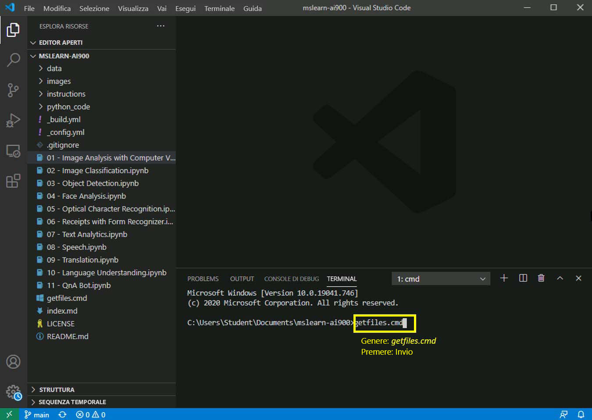

---
lab:
    title: 'Rilevamento degli oggetti'
---

# Esercitazione su AI-900
## Scarica i file più recenti

1.  Avvia Visual Studio Code (l'icona del programma si trova sulla barra delle applicazioni inferiore). All'apertura, puoi vedere il progetto MSLEARN-AI900 sul riquadro di sinistra.

2.  Scarichiamo la versione più recente del progetto. Nel terminale aperto, digita +++getfiles.cmd+++ e premi **invio**. Questo comando scarica la versione più recente del progetto nella tua cartella. 
3.  Una volta eseguito il comando, puoi chiudere il pannello del terminale. Ora puoi iniziare l'esercitazione. 

In questo laboratorio useremo il servizio Visione personalizzata in Azure per identificare più oggetti del mondo reale in un'immagine.

-  Apri il notebook **03 - Object Detection.ipynb** in Visual Studio Code.
    **Nota:** ti potrebbe essere richiesto di completare un sondaggio di 2 minuti. Vai avanti e seleziona **No, grazie**. Potresti doverlo fare più di una volta.
-  Segui le istruzioni nel notebook per completare l'esercitazione.
